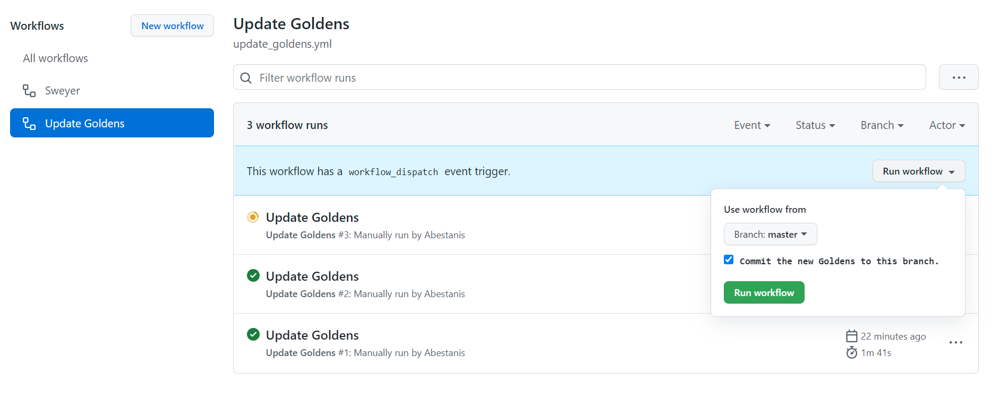
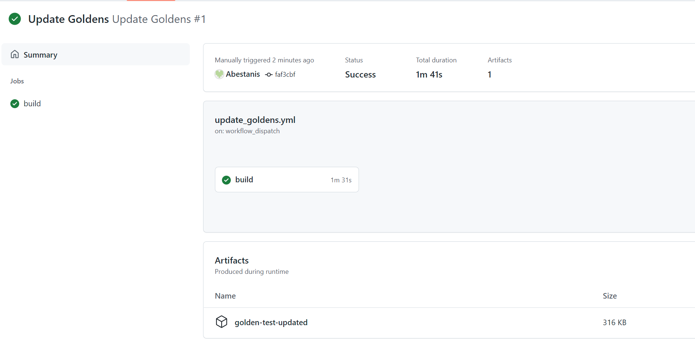

## Code style

The repo has a set of lints in [analysis_options](https://github.com/nt4f04uNd/sweyer/blob/master/analysis_options.yaml),
which are based of [flutter_lints](https://pub.dev/packages/flutter_lints) (with some tunes), and
that enfore the style that I'm following, so just following
them and the code that you see around you should be fine.

The project is also using auto dart formatter with line break
limit set to 120 characters (instead of default 80).

VSCode workspace is already configured to use 120 line break automatically.
Android Studios normal formatter unfortunately doesn't follow our formatting settings,
so please only use the `Reformat Code with 'dart format'` action for formatting.

To run it manually, use this command

```flutter format -l 120 .```

## Tests and golden tests

After you made some changes, run the tests

```shell
flutter test
```

This will run regular automated tests located in `test/` folder,
as well as golden tests, located in `test/golden`.

If you find that some automated tests failed - fix them.

If you find that some golden tests failed, ensure that those changes
are indeed expected, and if no - adjust your code, if yes - update
golden tests files.

## Updating golden tests

Because Flutter golden files are platform-specific, the golden files will vary slightly depending
on what platform you are using. To avoid creating unnecessary changes and to have the golden tests
consistent on the continuous integration tests, they should only be regenerated on Linux.

You can update golden tests files locally on Linux just by running
```shell
flutter test --update-goldens
```

To update the golden tests from Windows or MacOS, run the
[`Update Goldens`](https://github.com/nt4f04uNd/sweyer/actions/workflows/update_goldens.yml)
workflow on GitHub **in your fork**. Unless you are a collaborator, you can't run it on the main
repository. In the popup, choose on which branch the goldens should be updated and whether
the workflow should automatically create a commit on that branch with the updated golden artifacts:



The workflow also uploads a `golden-test-updated` artifact, which will contain the generated
golden files:



If you left the auto-commit option unchecked, those new files can be put into `test/golden/goldens`
folder and manually pushed to your PR.

## Coverage [](https://codecov.io/gh/nt4f04uNd/sweyer)

Coverage measures which lines of code are covered during the tests. It shows which part of the
code is untested. When adding a new feature, a test must be added to verify the new feature and to
avoid reducing the test coverage.
